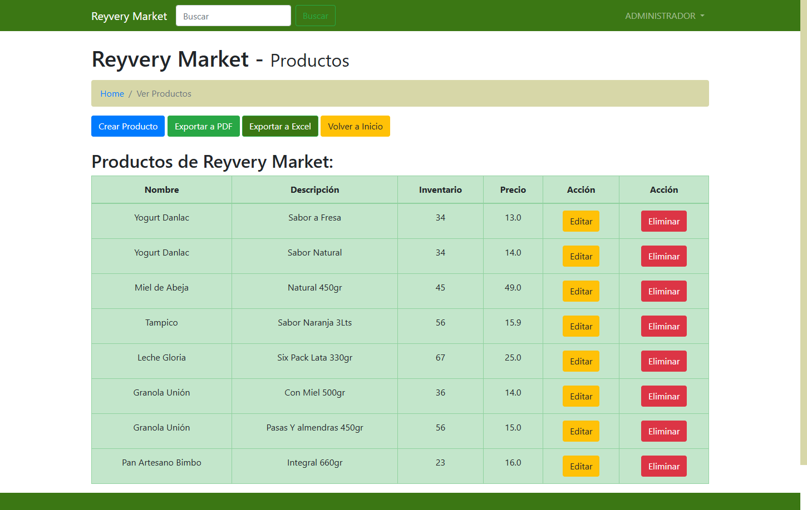
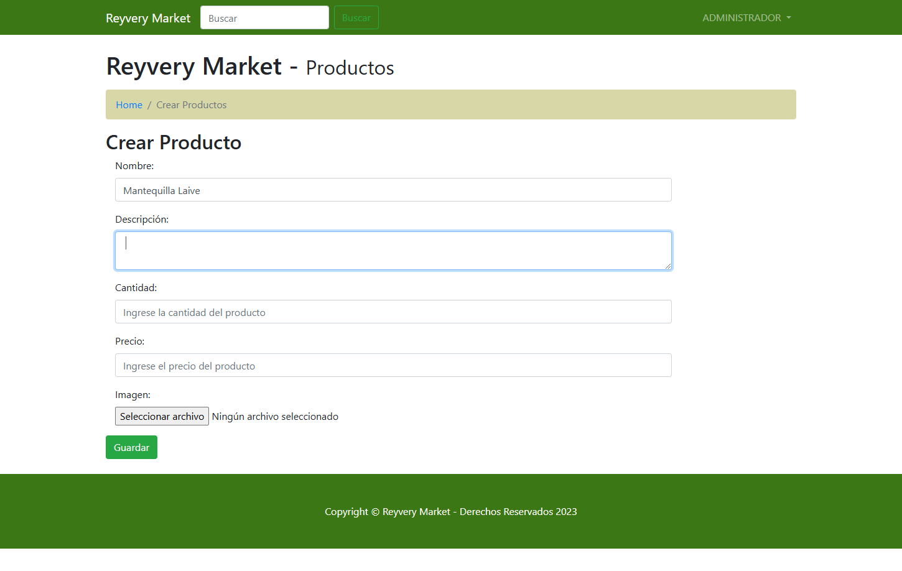
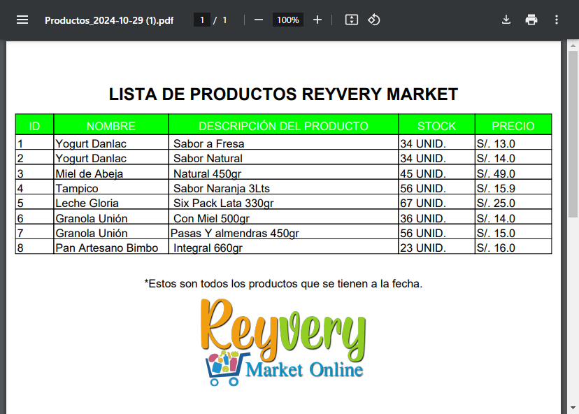
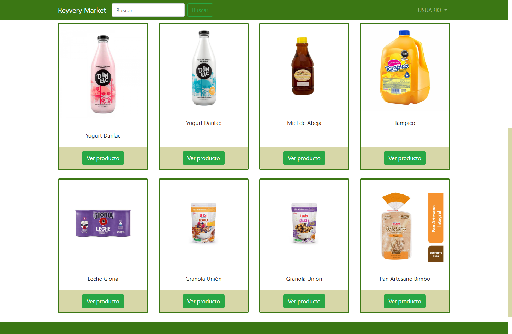
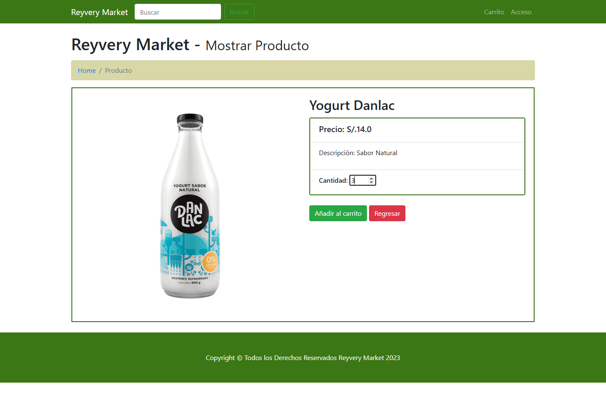
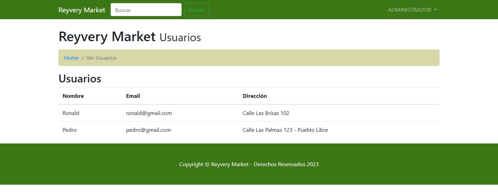
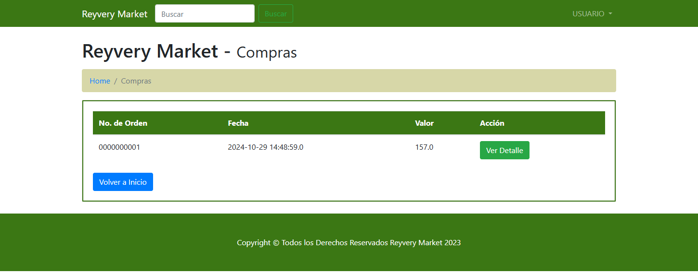

# Reyvery Market - E-commerce

**Reyvery Market** es una tienda en línea desarrollada en Java con **Spring Boot** y **MySQL**, que ofrece una amplia gama de productos naturales. La aplicación cuenta con un diseño responsivo y una interfaz intuitiva que facilita la navegación. Integra **Spring Security** para garantizar la protección de los datos y transacciones de los usuarios, y permite el registro e inicio de sesión de manera segura.

## Screenshots

)

)

)

)

## Features

- El Proyecto fue diseñado con interfaces simples e intuitivas, respetando los colores de la empresa y logos.
- Cuenta con un botón para ver el producto y conocer sus caracteristicas y propiedades, ahi mismo podemos elegir la cantidad que queremos comprar, el sistema web es fácil y muy intuitivo, Tambien cuenta con un botón de retorno para poder seguir eligiendo otro producto sea el caso.
- Sistema permite añadir varios productos para realizar la compra y los muestra en una tabla con sus propiedades y cantidades respectivas, tenemos un botón de quitar si no queremos un producto de la selección que realizamos.
- Sistema permite generar la orden de compra y poder ver los detalles de la boleta.
- El usuario al conectarse puede ver todas las ordines generadas a lo largo del tiempo como
  un pequeño hitorial de compras.
- Podemos ver el detalle de la compra como saber cuantos productos compro el
  usuario.
- Las opciones que tiene el administrador cuando se encuentan conectado son las siguientes: Productos, Usuarios, Ordenes.
- Podemos agregar nuestros los productos en la página web donde también podemos editar y eliminar.
- Podemos los usuarios registrados, los muestra en una tabla.
- Ver Ordenes.
- Se aplico Spring Security para encriptar las contraseñas.
- Realiza reportes en formato pdf y exel de los productos que tenemos registrados.

## Tech Stack

**Client:** 

Java: Lenguaje de programación utilizado para el desarrollo del lado del servidor.
Spring Boot: Framework para construir aplicaciones web y APIs de manera rápida y eficiente.
Thymeleaf: Motor de plantillas que permite la creación de vistas dinámicas en la aplicación web.
HTML/CSS: Estructura y estilo de la interfaz de usuario.

**Server:**
MySQL: Sistema de gestión de bases de datos relacional para almacenar información de productos y usuarios.
Spring Security: Framework que proporciona autenticación y autorización para asegurar las transacciones y datos de los usuarios.
